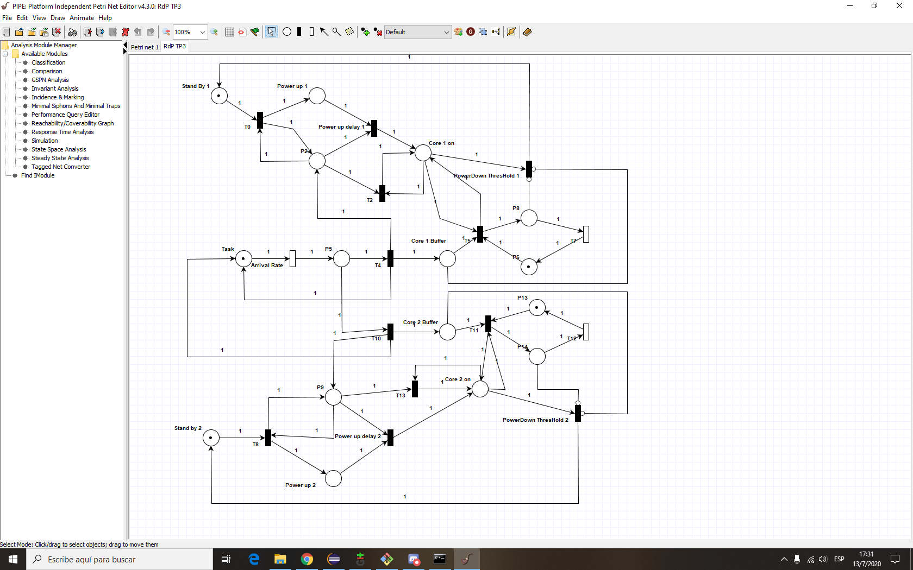

# Monitor de concurrencia con RdP

## Introduccion

Para la materia *Programacion concurrente* se tuvo que desarrollar como trabajo final integrador, un simulador de un procesador de 2 nucleos, que utilizara multiples hilos
para su ejecucion. Para esto, era requisito incorporar una red de petri. 

## Objetivo

La verificacion de un programa es un paso importante dentro del desarrollo del software, pero un fallo en un sistema critico es inaceptable ya que lleva a la perdida de vidas. 
La verificacion de un software critico, que usa algun tipo de concurrencia va a ser dificil, ya que los distintos interleavings que puede tener un programa concurrente pueden
ser virtualmente infinitos. Es por esto que se propone utilizar las **redes de petri**, que son grafos de marcado con 2 tipos de nodos. Estas redes, nos permiten saber **en
todo momento** el **estado** del programa, y ademas presentan propiedades inviolables que, conociendo dicho estado, puede verificarse si estas prpiedades se cumplen.

Asi, las redes de petri proporcionan una forma mas de verificacion de un programa concurrente que en muchos casos, puede ser un sistema critico.

## Resultado del projecto

Se logro implementar un monitor de concurrencia, basado en una red de petri que correctamente verifica el funcionamiento del programa
